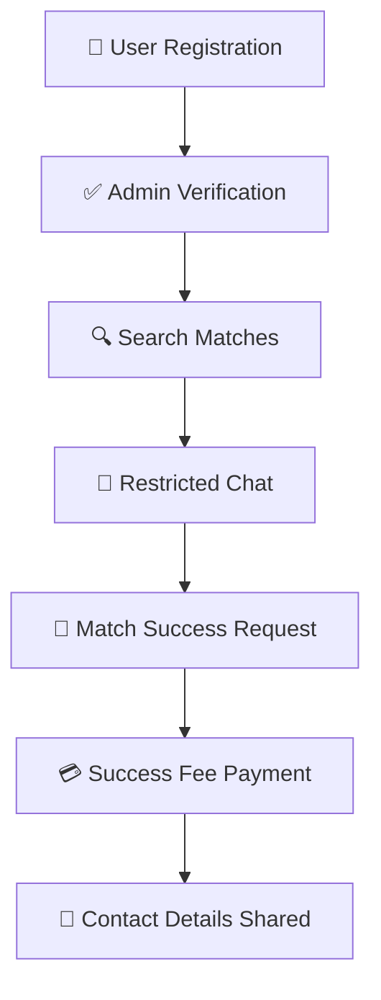
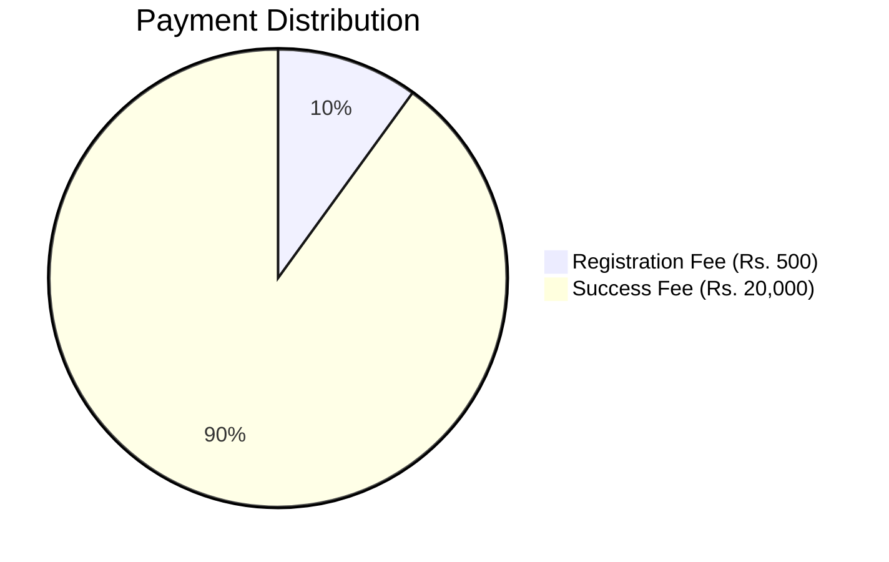

# 💍 Tamil Matrimony Platform  

  
  
  
  

A **secure, culturally sensitive online matrimony platform** tailored for **traditional Tamil families in Sri Lanka**.  
This platform introduces a **fairer payment model** and a **controlled communication system** to build trust and improve matchmaking success.  

---

## 🎯 Project Goal  
To create a trusted, culturally respectful matrimony system where:  
✔️ Users pay only **when a successful match is made**  
✔️ **Communication is safe** with moderated predefined questions  
✔️ Profiles are **verified** and **culturally aligned**  

---

## 🚨 Current Market Problem  
- ❌ High upfront registration fees (~Rs. 20,000)  
- ❌ No refunds or success guarantees  
- ❌ Contact details hidden or misused by site owners  
- ❌ Lack of **trust, transparency, and cultural sensitivity**  

---

## ✅ Proposed Solution  
- 💸 **Affordable Entry:** Rs. 500 registration fee  
- 💍 **Success Fee:** Pay Rs. 20,000 **only if a match is found**  
- 💬 **Safe Communication:** Predefined culturally-appropriate questions  
- 👨‍👩‍👧 **Admin Moderation:** Ensures trust, security, and compliance  

---

## ✨ Key Features  

### 👤 User Registration & Profiles  
- Profile fields for Tamil families (Religion, Caste, Horoscope, etc.)  
- Admin-verified profiles  

### 🔍 Search & Matchmaking  
- Basic & advanced filters  
- Automated recommendations  

### 💌 Communication  
- Restricted chat with predefined questions  
- Match request workflow (send / accept / decline)  

### 💳 Payment System  
- Rs. 500 registration fee  
- Rs. 20,000 success fee  
- Secure payment gateway integration  

### 🛡️ Admin Tools  
- Approve/reject profiles  
- Monitor/report misuse  
- Manage payments & reports  

### 🔒 Security  
- Encrypted data storage  
- Compliance with Sri Lankan IT & data regulations  

---

## 🛠️ Methodology  
- Agile-Scrum development approach  
- Continuous feedback from Tamil families & community representatives  

---

## 🎁 Expected Benefits  
- ✅ Fair pricing → **low upfront risk** for users  
- ✅ Higher **trust & transparency**  
- ✅ **Cultural respect** for Tamil traditions  
- ✅ Scalable to other communities in Sri Lanka  

---

## 📊 System Overview  

### Platform Flow  

### Payment Model

---

## 🚀 Tech Stack (Planned)

* **Frontend:** HTML/CSS/JS  
* **Backend:** PHP  
* **Database:**  MySQL/ PHPMYADMIN  
* **Authentication:**   
* **Payments:** PayHere (Sri Lanka support)  

---

## 🤝 Contributing

We welcome feedback and contributions!

1. Fork the repo 🍴  
2. Create a branch 🌱  
3. Submit a Pull Request 🔥  

---

## 📩 Contact

For suggestions & collaboration:  
📧 Email: ywanigaarachchi@gmail.com // 
🌐 Website: *coming soon*  

---

✨ *Building trustful and culturally aligned matches for Tamil families in Sri Lanka.* ✨
